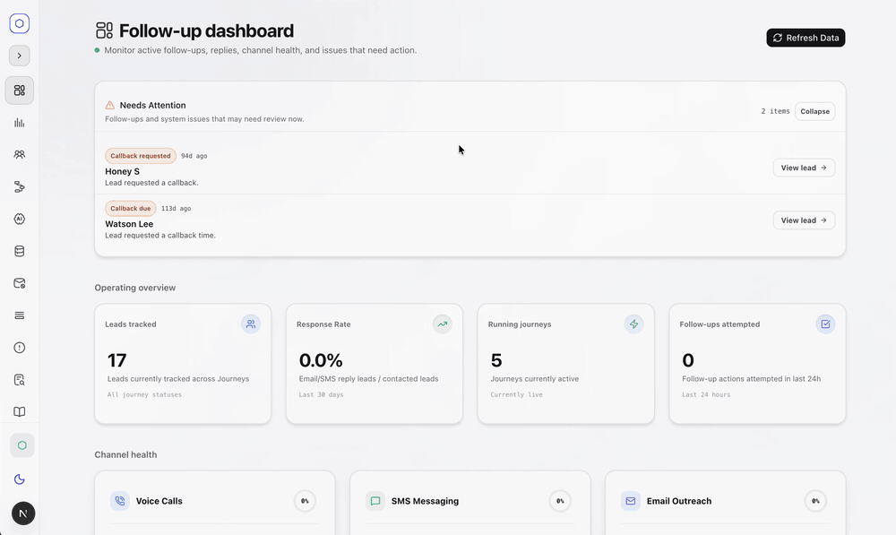

# Follow-Up Engine

A multi-tenant engine that follows up with leads over email, SMS and AI voice calls, and keeps every reply, call result and next step in one place.

You define a journey (for example: email now, SMS after a day, an AI voice call if there's still no reply). The engine works out when each step should go out, sends it through the right provider, stops when the lead responds, and hands the lead to a person when it needs one.



## What it does

- **Email, SMS and voice in one journey.** Gmail for email, Twilio for SMS, Retell AI for voice calls. Each tenant brings its own credentials and sender pool.
- **Voice agent calls with the results recorded.** Calls go out through Retell with the lead's details passed in as dynamic variables. Call results come back on a webhook and are matched to the lead by a `followup_lead_id` stamped on every outbound call.
- **Replies stop the sequence.** Inbound email, SMS and call outcomes cancel pending outbound steps, and email follow-ups reply in the same thread.
- **Business hours and rescheduling.** Steps that would land outside a tenant's business hours, or that fail, are moved to the next valid window.
- **Webhook triggers.** External systems can enrol leads through a webhook. A playground in the dashboard tests JSON paths against sample payloads.
- **Operator handoff.** When a lead needs a person, the engine alerts the team instead of carrying on blindly.
- **Visual journey builder.** Waits, conditional splits, custom fields and per-tenant templates, edited in the dashboard.

## How it's built

```
Dashboard (Next.js)  ──>  Supabase Postgres  ──>  Edge Functions  ──>  Gmail / Twilio / Retell
                          · leads, journeys,       · dispatch-*          (outbound)
                            runs, actions          · poll-gmail-inbox
                          · RPCs + pg_cron         · twilio-inbound      <── replies, call results
                            dispatcher             · retell-result           (inbound)
```

- **Dashboard** (`dashboard/`): Next.js and React with Tailwind and shadcn/ui. It covers tenants, leads, journeys, templates, senders, operations and analytics.
- **Database** (`supabase/migrations/`): Postgres schema and RPCs. The `actions` table is the single work queue, and `pg_cron` with `pg_net` dispatches due actions.
- **Edge Functions** (`supabase/functions/`): one function per provider direction. That's three outbound dispatchers (Gmail, Twilio, Retell), inbound handlers for SMS, email and call results, status polling, AI reply generation, and operator alerts.

The engine first ran on an external workflow runtime and was moved to native Postgres and Edge Functions. The reasoning for each step is written up in [`docs/decisions/`](docs/decisions/).

## Running it locally

You need Docker, the [Supabase CLI](https://supabase.com/docs/guides/local-development) and Node.js 20.9 or later. Everything runs on your machine; no Supabase account is needed.

**1. Start Supabase.** This applies every migration and loads `supabase/seed.sql`: a demo workspace with sample journeys and templates, the local Vault secrets the dispatcher needs, and an owner invite for `demo@example.com`.

```bash
supabase start
```

**2. Serve the Edge Functions** in a second terminal and leave it running:

```bash
cp supabase/functions/.env.example supabase/functions/.env
supabase functions serve
```

**3. Run the dashboard** in a third terminal:

```bash
supabase status -o env \
  --override-name api.url=NEXT_PUBLIC_SUPABASE_URL \
  --override-name auth.anon_key=NEXT_PUBLIC_SUPABASE_ANON_KEY \
  --override-name auth.service_role_key=SUPABASE_SERVICE_ROLE_KEY \
  | grep -E '^(NEXT_PUBLIC_SUPABASE_URL|NEXT_PUBLIC_SUPABASE_ANON_KEY|SUPABASE_SERVICE_ROLE_KEY)=' > dashboard/.env.local
echo 'INTERNAL_DISPATCH_KEY=local-dev-dispatch-key' >> dashboard/.env.local

cd dashboard
npm install
npm run dev
```

**4. Sign up** at http://localhost:3000/auth/signup (or the port `npm run dev` prints) with `demo@example.com` and any password of 8 or more characters. That account becomes owner of the demo workspace. Other emails sign up fine but have no workspace until an owner invites them.

**5. Try it.** Add a lead on the Leads page and pick `demo_journey_1`. The lead is enrolled and its first email is queued. Within 30 seconds the cron dispatcher hands it to the `dispatch-gmail-email` function, which reschedules it with "No sender available" until you connect a Gmail sender on the Settings page. That is the full path working without any provider account.

To send for real, add provider credentials per workspace in the dashboard: Gmail senders and Twilio and Retell credentials, all on the Settings page. Outbound email, SMS and calls then go through those accounts.

To start over with a clean database, run `supabase db reset`.

### Deploying

`supabase db push` applies the migrations to a hosted project, and `supabase functions deploy` deploys the functions. Seeds don't run there, so set the two Vault secrets yourself:

```sql
select vault.create_secret('https://<project-ref>.supabase.co', 'functions_base_url');
select vault.create_secret(encode(gen_random_bytes(32), 'hex'), 'internal_dispatch_key');
```

Then set the same dispatch key as `INTERNAL_DISPATCH_KEY` with `supabase secrets set` and in the dashboard's environment. [`dashboard/.env.example`](dashboard/.env.example) lists the dashboard variables, and [`docs/runbooks/`](docs/runbooks/) has the full launch checklist.

## Tests

```bash
cd dashboard
npm test            # unit tests (node --test)
npm run typecheck
npm run lint
npm run build
```

## Notes

Names, emails and phone numbers in seeds, fixtures and examples are made up.

## License

All rights reserved. The source is shared so people can read it; it isn't licensed for reuse.
